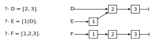

# DCC024 - Linguagens de Programação
## Lista 22

> Yuri Diego Santos Niitsuma

1. Uma função recursiva e dita de cauda rasa quando a ultima coisa que ela faz e chamar-se recursivamente. Re-implemente cada um dos predicados abaixo, para que eles sejam predicados de cauda rasa:

(a) O predicado que soma os elementos de uma lista:
```
sum([], 0).
sum([H|T], X) :- sum(T, XAux), X is XAux + H.
```

###### Resposta
```
sum([], acc, acc).
sum([H|T], acc, X) :- nAcc is acc + H, sum(T, nAcc, X).
```

(b) O predicado que inverte os elementos de uma lista:
```
myappend([], L, L).
myappend([H|T], L, [H|LAux]) :- myappend(T, L, LAux).
myreverse([], []).
myreverse([H|T], R) :- myreverse(T, RT), myappend(RT, [H], R).
```
###### Resposta
```
myreverse([], acc, acc).
myreverse([H|T], acc, X) :- myreverse(T, [H|acc], X).
```

<!-- pagebreak -->
(c) Afinal de contas, qual a vantagem de implementarmos funções de cauda rasa?
###### Resposta
> As funções de cada rasa servem geram um ganho de eficiência dado que os compiladores reaproveitam a memória que seria usada para criar mais registros de ativação.

2. O problema do subconjunto de soma $N$ e um problema NP-completo classico. Dado um conjunto $U$ de inteiros, e um numero inteiro $N$, o problema pede que seja encontrado um subconjunto $S$ de $U$ cuja soma seja $N$. Por exemplo, caso $U = \{1, 2, 3, 4, 5\}$ e $N = 6$, temos $S = \{1, 2, 3\}$, $S = \{1, 5\}$ e $S = \{2, 4\}$. Dado que o problema do subconjunto de soma $N$ e NP-completo, pouca esperança existe de que exista uma solução polinomial para ele. Logo, algoritmos que resolvem este problema baseiam-se em buscas exponenciais.  
Implemente este algoritmo em Prolog.

###### Resposta
```
sub([], []).
sub([H|T], [C|R]) :- sub(T, R).
sub([_|T], R) :- sub(T, R).
sum(L, N, S) :- sub(L, S), sum(S, N).
find(S, sum([2, 3, 5, 7, 11, 13, 17], 21, 5), 1).
```

3. Descubra o que faz o predicado `riddle` e o implemente de modo mais eficiente.
```
riddle(X,_) :-
  length(X, XL),
  XL = 0.

riddle(_,Y) :-
  length(Y,YL)
  YL = 0.
```
###### Resposta
> Verifica se as listas `X` e `Y` são vazias.

```
riddle(X, Y) :- length(X, XL), x <= 2, length(Y, YL), YL = 0.
```

<!-- pagebreak -->
4. Descubra o que faz o predicado `enigma` e o implemente de modo mais eficiente.
```
enigma(List1, N, List2) :-
  length(Dummy, N),
  append(List2, Dummy, List1).
```
5. Reescreva o predicado `factorial` abaixo, para que ele seja de cauda rasa:
```
xfactorial(1, 1).
xfactorial(N, FN) :-
  NextN is N-1,
  xfactorial(NextN, FNestN),
  FN is FNextN * N.
```
###### Resposta
```
factorial(N, FN) :- NextN is N-1, FN is FNextn*N, factorial(NextN, FNextn).
```

6. Linguagens como SML e Prolog, que utilizam listas pesadamente, muitas vezes reusam parte da estrutura das listas. Por exemplo, se considerarmos o programa abaixo, teremos:



Em geral, a reutilização de estruturas de dados e transparente para o programador, em uma linguagem que não possui efeitos colaterais.

(a) Em uma linguagem que possui efeitos colaterais, como Java, como saber se a implementação da linguagem reutiliza partes de estruturas de dados?
###### Resposta
> Os módulos dependentes dessa implementação deixam de funcionar.

<!-- pagebreak -->
(b) E em uma linguagem que não possui efeitos colaterais, como a parte de SML que vimos neste curso, como saber se a implementação da linguagem reutiliza partes de estruturas de dados?
###### Resposta
> Basta criar estruturas e atribuir partes delas a outras estruturas e modificar as iniciais, verificando se que receberam as atribuições também mudam.

7. Considere o programa C abaixo, que faz a multiplicação de matrizes:
```c
const int N = 600;

void mult1(int Z[N][N], int X[N][N], int Y[N][N]) {
  int i, j, k;
  for (i = 0; i < N; i++)
    for (j = 0; j < N; j++)
      for (k = 0; k < N; k++)
        Z[i][j] += X[i][k] * Y[k][j];
}
void mult2(int Z[N][N], int X[N][N], int Y[N][N]) {
  int i, j, k;
    for (i = 0; i < N; i++)
      for (j = 0; j < N; j++)
        for (k = 0; k < N; k++)
          Z[i][k] += X[i][j] * Y[j][k];
}
int main() {
  int X[N][N], Y[N][N], Z[N][N];
  init(X);
  init(Y);
  zero(Z);
  mult2(Z, X, Y);
}
```

<!-- pagebreak -->
(a) Implemente a função `init` que inicialize uma matriz $N \times N$, de tipo `int**` com dados aleatorios. Aproveite tambem e implemente uma função `zero`, que inicialize as posições de uma matriz de inteiros com o valor zero.
###### Resposta
```c
void zero(int ** matriz) {
  int i, j;
  for (i = 0; i < N; i++)
    for (j = 0; i < N; i++)
      matriz[i][j] = 0;
}

void init(int ** matriz) {
  srand(time(NULL));
  int i, j;
  for (i = 0; i < N; i++)
    for (j = 0; j < N; i++)
      matriz[i][j] = rand();
}
```

(b) Use a função `time`, do UNIX, para medir o tempo de execução do programa acima. Em seguida, substitua a chamada a `mult2` por uma chamada a `mult1`, e faça uma nova tomada de tempo. Repita o processo três vezes. Qual a media dos tempos obtidos com `mult1` e com `mult2`? Que versão do programa e então mais eficiênte?
###### Resposta
> Caso o programa seja compilado com gcc -O3, não há diferença.

(c) Qual a explicação para a diferença de tempo obtida na questão anterior? Se não houver nenhuma diferença, experimente aumentar a constante $N$, e repita as tomadas de tempo.
###### Resposta
> Caso não haja otimização, o programa que tem maior localidade de referência espacial (utiliza valores em posições mais próximas) será mais eficiente.
