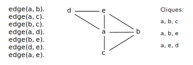

# DCC024 - Linguagens de Programação
## Lista 23

> Yuri Diego Santos Niitsuma

1. Escreva um predicado `max(X, Y, Z)`, que receba dois números, `X` e `Y` e unifique `Z` com o maior deles.
###### Resposta
```
max(X, X, X).
max(X, Y, X) :- X > Y.
max(X, Y, Y) :- Y > X.
```

2. Escreva um predicado `maxList(L, M)`, que receba uma lista `L` de números e unifique `M` com o maior número nesta lista. O predicado deve falhar se a lista estiver vazia.
###### Resposta
```
maxList([], [0]).
maxList([H|T], H) :- maxList([T|H2]), H >= H2.
maxList([H|T], H2) :- maxList([T|H2]), H2 > H.
```

3. Escreva um predicado `ordered(L)`, que seja verdadeiro se a lista `L` estiver em ordem crescente.
###### Resposta
```
ordered([]).
ordered([H|T]) :- T is [H2|_], ordered(T), T < H2.
```

<!-- pagebreak -->

4. Escreva um predicado `mergesort(In, Out)`, que receba duas listas, `In` e `Out`, e seja verdadeiro se `Out` for uma versão da lista `In`, ordenada em ordem crescente. Seu predicado deve usar o algoritmo de ordenacão *mergesort*. Note que SWI-PL já possui um predicado *merge*, que obviamente você não vai usar. Use um outro nome para seu predicado, ou haverá conflito com SWI-PL.
###### Resposta
```
fusion([], _, [], []).
fusion(X, Y, [], X) :- X < 1.
fusion([X|X2], Y, [X|Z], Z) :- ordered(T), H < H2.

mergesort([_], [_]).
mergesort([X|Y], [X|Y]) :- X <= Y.
mergesort([X|Y], [Y|X]) :- Y < X.
mergesort(In, Out) :- length(In, 2), K is L/2, fusion(In, K, X), mergesort([X|Y], [X|L2], [K], Out).
```

5. Escreva um predicado `nqueens(N, X)`, que receba um inteiro `N` e encontre uma solucão para o problema das $N$ rainhas. O problema das $N$ rainhas e parecido com o problema das oito rainhas, que e explicado nas transparências do livro usado no curso. Só que agora você precisa colocar $N$ rainhas em um tabuleiro de tamanho $N \times N$. Você pode comecar a partir do código que o autor do livro disponibilizou. Há um *link* para este código na página do curso.
###### Resposta
```
nocheck(_, []).
nocheck([X|Y], [X, |Y, |Rest]) :-
             X =|= X1, Y =\= Y1, (Y1-Y) =|= (X1-X), nqueens(X/Y).

legal([]).
legal([X/Y | Rest]) :-
             legal(Rest),
             nocheck(X/Y,
             Rest,
             member(X1, [1, 2, 3, 4, 5, 6, 7, 8]),
             member(Y, [1, 2, 3, 4, 5, 6, 7, 8])).

nqueens(L, X) :- L = [_, _, _, _, _, _, _, _], legal[L].
```

<!-- pagebreak -->

6. Escreva um predicado `multiknap(Pantry, Capacity, Knapsack)`, que funcione como o predicado `knapsackOptimization`, visto nas transparências do livro, mas que resolva o problema permitindo múltiplas ocorrências do mesmo item. Isto quer dizer que nesta versão do problema você pode pegar qualquer quantidade de itens da geladeira. Assim, se Pantry for:
```
[food(break, 4, 9200),
food(pasta, 2, 4600),
food(peanutButter, 1, 6700),
food(babyFood, 3, 6900)].
```

Então sua mochila irá conter zero ou mais cópias de `food(bread, 4, 9200)`, zero ou mais cópias de `food(pasta, 2, 4600)`, etc.

7. Um outro problema que e notoriamente difícil e o problema da cobertura de conjuntos. Você recebe duas listas: `Set` e `Subsets`. A primeira lista, `Subsets` e uma lista de listas, cada uma com uma sendo uma subsequência de `Set`. O problema e então encontrar o conjunto `Cover`: uma cobertura mínima, isto e, uma subsequência de `Subsets` com a propriedade que todo elemento de `Set` seja um elemento de alguma lista de Cover. Por exemplo, assuma que `Set` e a lista `[1, 2, 3, 4, 5]` e `Subsets` e a lista `[[1, 2], [2, 4], [3, 5], [1, 3], [3, 4, 5]]`. Então a cobertura mínima seria a lista `[[1, 2], [3, 4, 5]]`.

(a) Escreva um predicado `CoverDecision(Set, Subsets, Goal, Cover)`, que receba uma lista `Set`, uma lista `Subsets` contendo subsequências de `Set`, e um inteiro positivo `Goal`. Este predicado deve unificar Cover com a subsequência de `Subsets` que cubra `Set` e tenha tamanho menor ou igual `Goal`. O predicado falha se não houver nenhuma cobertura possível. A sua solucão deverá ser capaz de produzir todas as coberturas que satisfazem `Goal`.
###### Resposta
```
CoverDecision(Set, Subsets, Goal, Cover) :-
            Set(A, [H|T]), Cover([], _, Goal([])).
CoverDecision([], [_], Goal, []).
```

(b) Escreva um predicado `coverOptimization(Set, Subsets, Cover)` que receba uma lista `Set` e uma lista `Subsets`, como anteriormente. Este predicado deve unificar `Cover` com a subsequência da lista `Subsets` que cubra `Set`, e que tenha tamanho mínimo. O predicado falhará se não houver alguma sequência assim. A sua solucão deverá ser capaz de gerar todas as sequências de tamanho mínimo.


8. Uma *clique* e um grafo completo. O problema de decidir se um grafo $G$ possui uma clique de tamanho $N$ e um problema NP-completo bem conhecido. Esse problema, inclusive, e parte da lista de 21 problemas proposta por Richard Karp em 1972. Embora não conhecamos qualquer algoritmo eficiente para encontrar cliques em grafos, e muito fácil resolver esse problema por forca bruta em Prolog. Nesse caso, podemos representar um grafo como um conjunto de arestas, conforme feito na figura abaixo:



O predicado `cliqueN`, definido abaixo, e verdade quando `G` e uma lista de vertices de um grafo, `N` e um número inteiro, e `L` e uma sublista de `G` que forma uma clique:
```
cliqueN(N, G, L) :- sublist(G, L), length(L, N), clique(L).
```

Por exemplo:

```
?- consult(clique).
% clique compiled 0.00 sec, 64 bytes
true.
?- cliqueN(3, [a, b, c, d, e], L).
L = [a, b, c] ;
L = [a, b, e] ;
L = [a, d, e] ;
false.
```

(a) Defina o predicado `sublist(G, L)`, que seja verdade quando `L` for uma sublista de `G`.

(b) Defina o predicado `clique(L)`, que seja verdade quando `L` for uma lista de vertices que forme um grafo completo.
